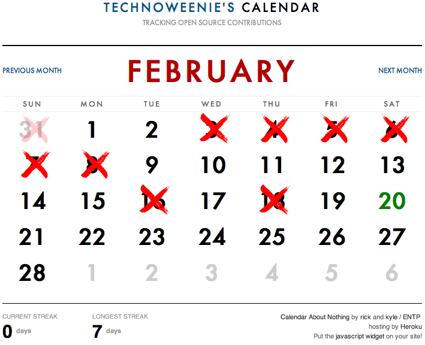

!SLIDE
# Asynchronous Coding For My Tiny Ruby Brain #

by rick olson  
pdx javascript admirers, 24 Feb 2010  
[http://github.com/technoweenie/pdxjs-twitter-node](http://github.com/technoweenie/pdxjs-twitter-node)  
[http://pdxjs-twitter-node.heroku.com](http://pdxjs-twitter-node.heroku.com)

!SLIDE center
# My name is Rick Olson #

!SLIDE center

!SLIDE center

### Lighthouse ###

!SLIDE center

### Tender ###

(not part of the dharma initiative... or is it?)