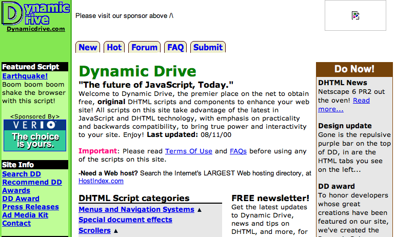
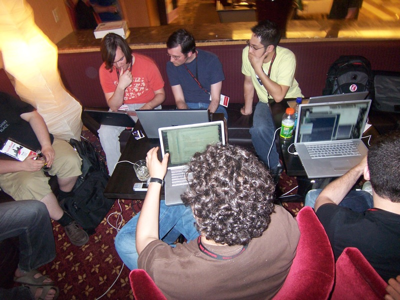

!SLIDE center

# Started Javascript 10 years ago #

!SLIDE center

!SLIDE center

# Joined the Air Force #

!SLIDE center

# Server-Side Hacking #

!SLIDE bullets

# My Perspective in 2010 #

* Mostly dynamic, synchronous code (ruby, c#, python, php)
* Javascript is mostly for UI effects and AJAX
* Javascript is written by designers

!SLIDE center

# Node.js required a big reset #

